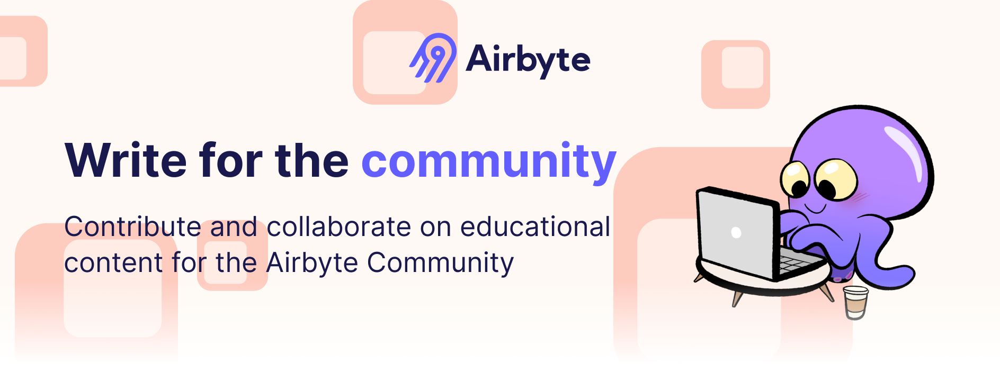

## Guidelines
Our full guidelines for publishing can be found [here](./GUIDELINES.md). Additionally, our FAQ which includes information on payment and the review process can be found [here](https://www.notion.so/Write-for-Airbyte-FAQ-de5c369a4973489cbad067205537038d).

## Our Philosophy
Airbyte is fully open by design. We share our [roadmap](https://docs.airbyte.io/project-overview/roadmap), [strategy](https://handbook.airbyte.io/strategy/strategy) and everything about our [business model](https://handbook.airbyte.io/strategy/business-model). 

In this fashion, this repository is designed to share about our [roadmap](https://github.com/airbytehq/community-content/projects/1) in terms of content publications, so you can vote on the articles, tutorials and videos we plan to work on, and also contribute them!

## Contributing
If you want to help push our content roadmap forward, here are the different types of contributions you can help with. 

* [Request a publication](https://github.com/airbytehq/community-content/issues/new?assignees=&labels=&template=request-a-publication.md&title=)
* [Submit a publication](https://github.com/airbytehq/community-content/issues/new?assignees=&labels=&template=submit-a-publication.md&title=)
* [Update a publication](https://github.com/airbytehq/community-content/issues/new?assignees=&labels=&template=update-a-publication.md&title=)
* [Translate a publication](https://github.com/airbytehq/community-content/issues/new?assignees=&labels=translation&template=translate-a-publication.md&title=)

This is how we differentiate the different types of publications:
* **Articles** are pieces that will go on our blog, which are usually higher level explorations of the data engineering space, but not always.
* **Recipes** are educational use cases to help Airbyte users understand how they can leverage Airbyte in data engineering, marketing, customer success, sales, finance and other use cases. You can see examples [here](https://airbyte.io/recipes)
* **Operator guides** are located in our documentation to help Airbyte users better leverage Airbyte with other tools of the data stack. Some examples are [here](https://docs.airbyte.io/operator-guides).

**Once you're submitted your content**, you can move it down the different steps of the process in the [community project here](https://github.com/airbytehq/write-for-airbyte/projects/1).

We look forward to seeing what the community requests and produces! We value the different ways that people use Airbyte and would love to explore all the possibilities that exist with the technology.

We are not looking for promotional pieces or marketing pitches. 
